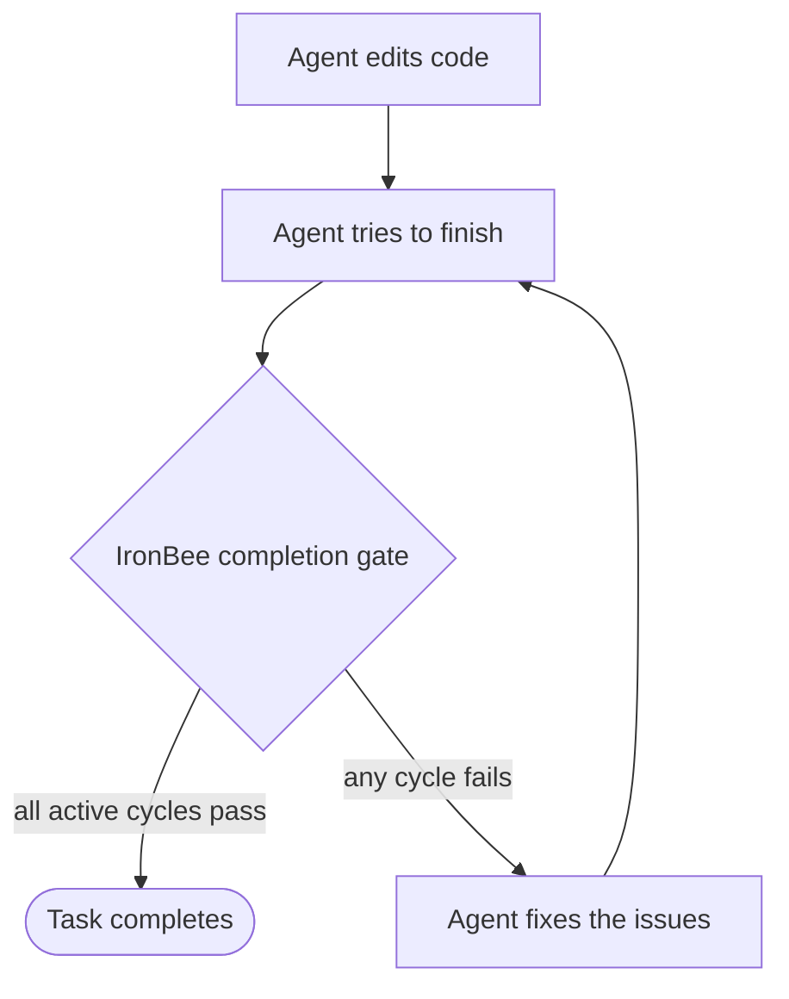

IronBee's core idea is simple: **code isn't done until it's verified.** This page explains the mechanism behind that: how IronBee intercepts task completion, what the agent has to do to pass, and what happens when it doesn't.

---

## The completion gate

When you run `ironbee install`, IronBee registers a **completion hook** with your AI client (the `Stop` hook in Claude Code and Codex, the `stop` hook in Cursor). It fires when the agent tries to finish a task.

If the agent changed code files, the hook runs verification before letting the task complete:



If no code files changed (docs, config, etc.), the gate doesn't trigger.

---

## Verification cycles

A **cycle** is one pass of testing against a real surface. IronBee has four, and any combination can be active for a project:

| Cycle | Exercises the change through… |
|-------|-------------------------------|
| Browser | A real browser, navigation, screenshots, console, accessibility |
| Node | The Node.js V8 inspector, probes and runtime snapshots |
| Backend | Real protocol calls HTTP, gRPC, GraphQL, WebSocket |
| Android | An emulator over ADB taps, swipes, screenshots, UI snapshots, Logcat |

When a task completes, **every active cycle whose patterns match the changed files must pass in the same verification attempt**. They run in parallel, not one task at a time. See [Verification](/cli/guides/verification) for choosing which cycles are active.

---

## The verdict

To pass a cycle, the agent exercises the affected paths with that cycle's tools and submits a **verdict**, its assessment of whether the change works:

```json
{
  "status": "pass",
  "checks": [ ... ],
  "issues": [ ... ],
  "fixes":  [ ... ]
}
```

IronBee doesn't take `status: "pass"` at face value. Each cycle defines the tools that must appear on the wire before a pass counts: required tools (all-of) and alternative evidence paths (any-of). If the agent claims success without actually using the tools, the gate overrides the verdict to **fail**. This is what stops an agent from declaring "it works" without testing.

---

## Retries

A failed verdict sends the agent back to fix the issues and verify again. The [`maxRetries`](/cli/configuration/configuration#core-options) limit (default **3**) caps this loop: once it's hit, the agent is allowed to complete the task **but must report the unresolved issues** rather than silently pass. One counter covers all active cycles.

---

## Who drives the tools

On **Claude Code** and **Codex**, the main agent doesn't run the devtools tools itself — it **delegates to a dedicated `ironbee-verifier` sub-agent** that owns them. This keeps the heavy devtools output (DOM, console, screenshots) out of the main conversation while still recording everything to the same session. **Cursor** has no sub-agent surface, so its main agent verifies directly. See [Verification → How verification runs](/cli/guides/verification#how-verification-runs-the-verifier-sub-agent).

---

## Default vs custom scenarios

By default the gate verifies only the areas affected by what changed. You (or the agent) can instead pass a **custom scenario** to [`/ironbee-verify`](/cli/clients/claude-code#slash-commands) — inline text or a path to a scenario file — to specify exactly which flows, states, and endpoints to exercise. See [Custom verification scenarios](/cli/guides/verification#custom-verification-scenarios).

---

## Beyond enforce mode

Enforcement is one of three [verification modes](/cli/guides/verification#verification-modes):

- **Monitoring-only** (`ironbee verification disable`) - the gate is never installed. The agent works unblocked, but session lifecycle, tool calls, and timing still flow to the Collector. Useful for measuring baseline behavior before turning enforcement on.
- **Assist** (`ironbee verification auto disable`) - the `/ironbee-verify` command, the verifier sub-agent, and devtools MCP servers stay installed so the agent can verify on demand, but no gate ever blocks completion. Every manual cycle is still recorded to the Collector.

---

## Area-specific guidance

Teams can steer *how* the agent verifies a given part of the codebase by committing [`.ironbee/VERIFICATION.md`](/cli/guides/verification-context) files. When a change touches that area, IronBee injects the matching guidance into the agent's context as it starts verifying: advisory instructions layered on top of the standard flow, resolved hierarchically from the changed paths.

---

## Session isolation

Every agent task runs as its own **session**, tracked independently in `.ironbee/sessions/<id>/`. Concurrent sessions, even in the same project, keep separate event logs, verdicts, and retry counters, so they never interfere. See [Runtime files](/cli/advanced/runtime-files) for what's stored per session.

---

## What's next?

<CardGroup cols={2}>
    <Card title="Manage Projects" icon="search" href="/cli/guides/managing-projects">
        Install, remove, track, and update IronBee across your projects.
    </Card>
    <Card title="Verification" icon="shield-check" href="/cli/guides/verification">
        Choose which cycles run and how enforcement behaves.
    </Card>
</CardGroup>
