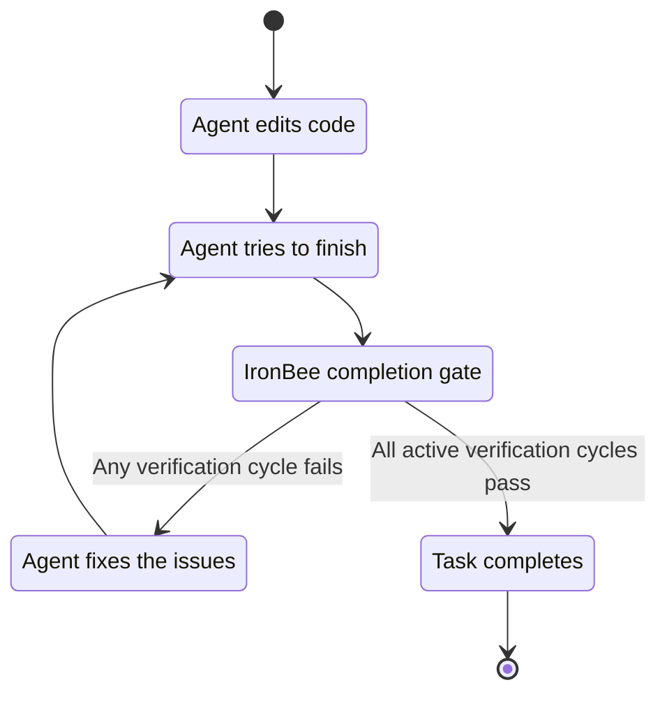

IronBee ensures that AI coding agents **verify their changes before completing a task**. When an agent edits code, it cannot finish until it exercises the affected paths through real tools navigating pages in a browser for frontend changes, or connecting to a running Node process for backend changes and submits a passing verdict.

No more "it should work" every change is tested.

## The problem

AI coding agents are fast, but they lack accountability. An agent can write hundreds of lines of code, declare success, and move on without ever checking if the browser renders correctly, if the API responds as expected, or if anything broke.

Teams using agentic development today face:
- Silent regressions that only surface in code review or production
- No evidence that a change was actually tested
- No insight into how the agent spent its time, what it struggled with, or where it kept failing

## What IronBee does

<CardGroup cols={2}>
  <Card title="Enforced verification" icon="shield-check">
    The agent must exercise affected code paths with real tools before it can mark a task complete. Browser navigation, screenshots, console checks, and network monitoring are required not optional.
  </Card>
  <Card title="Session analytics" icon="chart-bar">
    Every coding session is recorded time spent coding vs. fixing, pass/fail rates per file, retry counts, and tool usage. The console turns raw session data into actionable insights.
  </Card>
  <Card title="AI-powered analysis" icon="sparkles">
    After each session, IronBee runs an LLM analysis pass to surface findings and recommendations what went wrong, what patterns keep appearing, and what to do next.
  </Card>
  <Card title="Automatic recommendations" icon="wand">
    Findings are turned into directives that are automatically injected into the agent's context on future sessions, it learns from past mistakes without manual intervention.
  </Card>
  <Card title="CI/CD integration" icon="git-branch">
    The IronBee GitHub Action brings the same verification loop into your pull request workflow automatically verifying changes, fixing issues, and posting evidence on every PR.
  </Card>
  <Card title="Full observability" icon="eye">
    Every tool call, verification cycle, fix attempt, and verdict is captured and available in the Console with traces, timelines, and cost breakdowns.
  </Card>
  <Card title="Security" icon="lock">
    Never collects prompt content, file content, tool output, credentials (API keys and authentication tokens), or any PII beyond your org-configured email. Your code and secrets stay on your machine.
  </Card>
</CardGroup>

## How it works

All session data — tool calls, verifications, verdicts, timing — is captured and made available in the [Console](/console/projects).

---

## Supported AI clients

| Client | Status |
|--------|--------|
| [Claude Code](https://docs.anthropic.com/en/docs/claude-code) | Supported |
| [Cursor](https://cursor.com) | Supported |
| [Codex](https://github.com/openai/codex) | Supported |
| OpenCode | Planned |

## Next steps

<CardGroup cols={2}>
  <Card title="Quick start" icon="rocket" href="/getting-started/quickstart">
    Install the CLI and run your first verification in five minutes.
  </Card>
  <Card title="Key concepts" icon="book-open" href="/getting-started/key-concepts">
    Learn the terminology: sessions, verifications, cycles, verdicts, and more.
  </Card>
</CardGroup>
