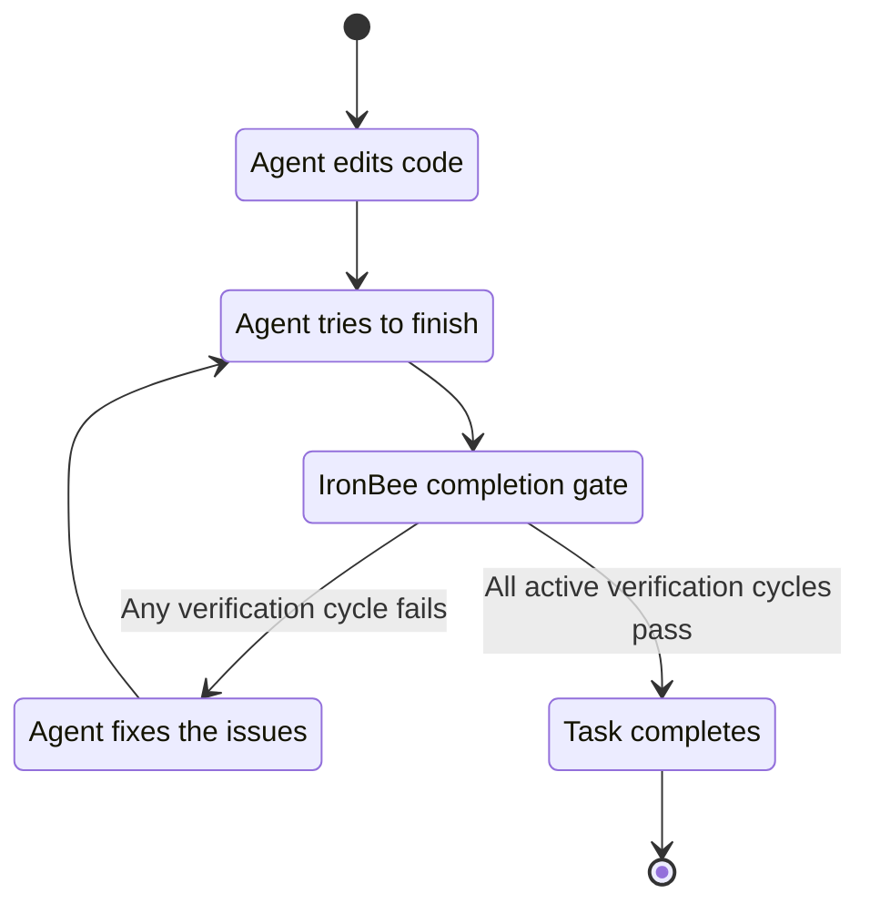

IronBee is your AI QA engineer. It verifies code changes the way a QA engineer would: it opens the running application, exercises what changed, and reports what works and what doesn't, with the evidence to prove it.

There are two ways in, and you can use both:

- **On your deployments and pull requests.** Connect GitHub, Vercel or Netlify, and IronBee verifies each preview deployment or pull request on its own infrastructure. The result lands on the pull request, on the deployment, and in the console.
- **Inside your AI coding agent.** The IronBee CLI gives Claude Code, Cursor and Codex the tools to verify their own changes in a real browser, a running backend or a terminal before they call the work done.

## The problem

AI coding agents are fast, but they lack accountability. An agent can write hundreds of lines of code, declare success, and move on without ever checking if the browser renders correctly, if the API responds as expected, or if anything broke.

Teams using agentic development today face:
- Silent regressions that only surface in code review or production
- No evidence that a change was actually verified
- No insight into how the agent spent its time, what it struggled with, or where it kept failing

## What IronBee does

<CardGroup cols={2}>
  <Card title="Verification on every change" icon="shield-check">
    Every preview deployment on Vercel or Netlify, and every push or pull request with the GitHub Action, starts a verification run. An agent reads the change and exercises it against your running app.
  </Card>
  <Card title="Verification inside your agent" icon="terminal">
    With the IronBee CLI, your AI coding agent verifies its own changes with real tools. In assist mode you ask for a verification; in enforce mode the agent can't finish until the verification passes.
  </Card>
  <Card title="Evidence for every run" icon="eye">
    Every verification run is captured and available in the console: the recording, screenshots, actions, network requests, traces, and logs. Watch a run live while it's in progress.
  </Card>
  <Card title="Results where you work" icon="git-pull-request">
    Results land as a check and a comment on the pull request, as a Vercel deployment check or on the Netlify deploy page, and in the console. The GitHub Action can also fix what it finds.
  </Card>
  <Card title="AI-powered analysis" icon="sparkles">
    Every day, IronBee runs an LLM analysis over each project's recent sessions to surface findings and recommendations: what went wrong, what patterns keep appearing, and what to do next.
  </Card>
  <Card title="Automatic recommendations" icon="wand">
    Findings are turned into directives that are automatically injected into the agent's context on future sessions, it learns from past mistakes without manual intervention.
  </Card>
  <Card title="Security" icon="lock">
    Never collects prompt content, file content, tool output, credentials (API keys and authentication tokens), or any PII beyond your org-configured email. Your code and secrets stay on your machine.
  </Card>
</CardGroup>

## How it works

### On your deployments and pull requests

1. A preview deployment on Vercel or Netlify, or a push or pull request with the GitHub Action, starts a **verification run**.
2. An agent on IronBee reads the change, then verifies it. A web app is opened in a browser and exercised like a user would. An API is called directly and its responses are checked against the contract.
3. The verdict and its evidence land on the pull request, on the deployment, and on the project's **Verifications** tab in the console, where you can also follow the run live.

See [How integrations work](/integrations/overview).

### Inside your AI coding agent

```mermaid actions={false}
stateDiagram-v2
    [*] --> AgentEditsCode
    AgentEditsCode: Agent edits code

    AgentEditsCode --> AgentTriesToFinish
    AgentTriesToFinish: Agent tries to finish

    AgentTriesToFinish --> CompletionGate
    CompletionGate: IronBee completion gate

    CompletionGate --> AgentFixesIssues: Any verification cycle fails
    AgentFixesIssues: Agent fixes the issues

    AgentFixesIssues --> AgentTriesToFinish

    CompletionGate --> TaskCompletes: All active verification cycles pass
    TaskCompletes: Task completes

    TaskCompletes --> [*]
```

This is enforce mode. In the default assist mode, the same verification runs when you or the agent ask for it with `/ironbee-verify`, and nothing blocks the agent. Every session and its verification cycles are available in the [console](/console/verifications). See [How verification works](/cli/concepts/how-it-works).

---

## Supported AI clients

| Client | Status |
|--------|--------|
| [Claude Code](https://docs.anthropic.com/en/docs/claude-code) | Supported |
| [Cursor](https://cursor.com) | Supported |
| [Codex](https://github.com/openai/codex) | Supported |
| OpenCode | Planned |

## Next steps

<CardGroup cols={2}>
  <Card title="Quickstart" icon="rocket" href="/getting-started/quickstart">
    Connect GitHub, Vercel or Netlify, or set up the CLI.
  </Card>
  <Card title="Key concepts" icon="book-open" href="/getting-started/key-concepts">
    Projects, verification runs, environments, sessions and verdicts.
  </Card>
</CardGroup>
