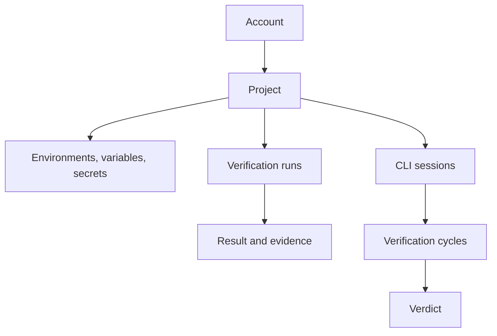

IronBee organizes everything around **projects**. A project collects two kinds of work:
- **verification runs**, which IronBee executes on its own infrastructure for your deployments and pull requests
- **sessions**, which your AI coding agent records with the IronBee CLI

---

## Account

Your **account** is the workspace your team shares. It holds your projects, integrations and settings. Everyone in it has a role: **Owner**, **Admin**, **Member** or **Billing Admin**. See [Roles and permissions](/console/roles).

---

## Project

A **project** is what IronBee verifies:
- a GitHub repository
- a Vercel project
- a Netlify site
- a **CLI project**: a name your IronBee CLI reports under

Owners and admins enable GitHub, Vercel and Netlify projects from [Integrations](/integrations/overview). CLI projects appear on their own the first time the CLI reports under a name. See [How IronBee identifies your project](/cli/concepts/projects).

Every project has a **verification type**:
- **Web**: open the deployment in a browser and exercise it as a user would.
- **API**: call the deployment over HTTP and check the responses against its contract.

A project that is no longer enabled on its provider is **Not active**: it keeps its history, and its deployments aren't verified. A project can also be archived. See [Project settings](/console/project-settings).

---

## Verification run

A **verification run** is one verification of a change: a preview deployment, a push, a pull request, or a run you start yourself. An agent reads what changed, exercises it against your running app, and records a **result** with the evidence behind it.

Every run has:
- **A trigger**, what started it: **Vercel**, **Netlify**, **GitHub Actions**, **API**, **CLI** or **Console**.
- **A status**, where it is: Created, Queued, Starting, Running, Completed, Failed, Cancelled.
- **A result**, what it concluded: **Pass**, **Fail**, **Not applicable** (the change left nothing to verify), **Soft fail** or **Unknown**.
- **The source** it verified, for runs tied to a GitHub repository: repository, branch, commit and pull request.

Runs appear on the project's [Verifications](/console/verifications) tab. While a run is in progress you can watch it live, and afterwards replay it on its [verification detail](/console/verification-detail) page.

---

## Environment, variable and secret

An **environment** is one deployment of a project that runs are verified against, such as `preview` or `staging`. Integrations create environments automatically. Its **URL**, **OpenAPI document** and **Domain** properties tell the run about the deployment. See [Environments](/console/environments).

**Variables** are plain values a run is told outright. See [Variables](/console/variables).

**Secrets** are credentials a run can use without seeing them: sign-in credentials, tokens, headers, a deployment protection bypass. They're written once and never shown again. See [Secrets](/console/secrets).

Variables and secrets apply to all environments, or to one.

---

## Evidence

The **evidence** of a run is everything it recorded:
- the recording and screenshots
- the actions it took
- the network requests
- the traces
- the logs

A **span** is one timed operation inside a trace. The **Traces** tab shows the spans as a tree.

---

## Session

A **session** is one working session of your AI coding agent with the IronBee CLI, from start to finish. It records what the agent did: its activities, its verification cycles, and their verdicts.

An **activity** is one agent turn: from your prompt to the moment the agent stops.

---

## Verification cycle

A **verification cycle** is one pass of verification inside a session. The CLI verifies through six platforms:

| Platform | Default | Verifies through |
|----------|---------|------------------|
| Browser | On | A real browser: navigation, screenshots, console, accessibility |
| Node | Opt-in | The Node.js runtime: probes, snapshots, outbound HTTP |
| Python | Opt-in | A running Python process over debugpy: probes, thread dumps, outbound HTTP |
| Backend | Opt-in | Real HTTP, gRPC, GraphQL or WebSocket calls |
| Android | Opt-in | An emulator: taps, swipes, screenshots, UI snapshots, Logcat |
| Terminal | Opt-in | CLI, REPL and TUI programs in a pseudo-terminal |

Every enabled platform that matches the changed files takes part in the same cycle. Turn platforms on or off with `ironbee <platform> enable|disable`. See [Verification](/cli/guides/verification).

In the console, CLI cycles appear among the project's verification runs with the **CLI** trigger.

---

## Verdict

A **verdict** is the agent's assessment of whether its change works:

- `status`: `pass`, `fail`, or `not_applicable` when the change has nothing to verify
- `checks`: what the agent confirmed, such as "form submits successfully"
- `issues`: what went wrong. On a pass they're advisory; on a fail they must be fixed
- `fixes`: what was changed to resolve earlier issues

IronBee doesn't take a pass at face value. Each platform requires certain tools to have been used before a pass counts. In enforce mode, the gate rejects a pass without them and sends the agent back to verify.

---

## Fix

A **fix** is a code change the agent makes after a failed verification. The agent then verifies again, up to a retry limit. The GitHub Action can fix findings too, and commit the fix for you.

---

## Verification modes

The CLI runs in one of three modes:

| Mode | What it does |
|------|--------------|
| **Assist** *(default)* | The verification tools are installed. You or the agent run a verification with `/ironbee-verify`, and nothing blocks completion |
| **Enforce** | The agent can't finish a task until every active cycle passes. Turn it on with `ironbee verification auto enable` |
| **Monitor** | Nothing is verified. Sessions, tool calls and timing are still recorded |

See [Verification modes](/cli/guides/verification#verification-modes).

---

## Analysis, findings and recommendations

Once a day, IronBee analyzes each project's recent sessions:
- The [Quality analysis](/console/analysis) measures how well the agent verifies.
- [Findings](/console/findings) are observations grounded in that data, such as a file with a high fix rate or a pattern of retries. They aren't necessarily bugs.
- [Recommendations](/console/recommendations) are directives generated from findings.

---

## Config files

The CLI reads its config from three layers, deep-merged (project-local wins over project, which wins over global):

| File | Scope | Committed? |
|------|-------|------------|
| `~/.ironbee/config.json` | Global, applies to all projects | N/A |
| `<project>/.ironbee/config.json` | Project-level, shared with your team | Yes |
| `<project>/.ironbee/config.local.json` | Project-local, machine-specific overrides | No (gitignored) |

The `IRONBEE_SERVICE_API_KEY` environment variable overrides `service.apiKey` from any config file. See [Configuration](/cli/configuration/configuration).
