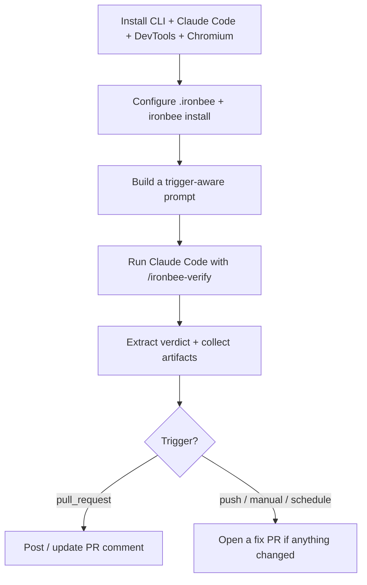

The IronBee Action runs the same verification loop as the [CLI](/cli/concepts/how-it-works), but unattended in CI. Instead of gating a developer's task, it reviews what changed on a push or pull request, drives Claude Code through verification, and turns the result into a PR comment or a fix PR. This page explains what happens on each run.

---

## The run, step by step

Every run is a single composite job that sets up the toolchain, verifies, and reports:

<Steps>
  <Step title="Install">
    Pins and installs `@ironbee-ai/cli`, `@anthropic-ai/claude-code`, `@ironbee-ai/devtools`, and Playwright Chromium (cached across runs).
  </Step>
  <Step title="Configure">
    Writes `.ironbee/config.json` with the collector URL and per-mode DevTools flags, then runs `ironbee install --client claude` to wire up hooks, skills, rules, and MCP config. Your API key is passed as an env var, never written to disk.
  </Step>
  <Step title="Prompt">
    Builds a verification prompt tailored to the trigger — diff-based for pushes and PRs, full-application for manual and scheduled runs.
  </Step>
  <Step title="Verify">
    Runs Claude Code with `/ironbee-verify`, which exercises the change through each enabled DevTools mode and submits a verdict.
  </Step>
  <Step title="Report">
    Extracts the final verdict, uploads evidence, and posts a PR comment or opens a fix PR depending on the trigger.
  </Step>
</Steps>

---

## The completion gate

Verification is enforced by the same **completion gate** the CLI installs — see [How Verification Works](/cli/concepts/how-it-works) for the full mechanism. In CI, the action instructs the agent to run `/ironbee-verify`, fix any issues it finds, and re-verify. The gate is what makes that meaningful: each cycle defines the tools that must appear on the wire before a pass counts, so the agent can't declare success without actually exercising the change.

---

## The verdict

To pass, the agent exercises the affected paths and submits a **verdict** — `pass`, `fail`, or `unknown` — with the checks it ran, issues it found, and fixes it applied. The action surfaces the final verdict two ways:

- As the [`verdict` output](/github-action/configuration/configuration#outputs) you can branch on in later workflow steps.
- As a badge at the top of the [PR report](/github-action/guides/running-in-ci#the-pr-report).

A run can go through several cycles — a failing verdict sends the agent back to fix and re-verify before the final result is recorded.

---

## Verification scope

The prompt the action builds depends on what triggered it:

| Scope | When | What the agent verifies |
|-------|------|-------------------------|
| Focused | `pull_request`, `push` | Only the areas affected by the diff |
| Full | `workflow_dispatch`, `schedule` | The entire application, no diff required |

See [Running in CI](/github-action/guides/running-in-ci) for the full breakdown.

---

## Fix behavior

When verification produces fixes, where they land depends on the trigger:

- **Pull request** — fixes are committed directly to the PR branch and the agent re-verifies.
- **Push, manual, scheduled** — fixes are moved to a new branch and opened as a fix PR; the original ref is left untouched.

---

## Sessions and recording

Each run is recorded as a **session** to the IronBee collector and shows up in the [Console](https://console.ironbee.ai), with the full timeline, recordings, and per-cycle verdicts. Locally, the same data is written under `.ironbee/sessions/<id>/` and collected into the uploaded evidence artifact. The [PR report](/github-action/guides/running-in-ci#the-pr-report) links straight to the session and to each verification cycle in the Console.

---

## What's next?

<CardGroup cols={2}>
  <Card title="Running in CI" icon="git-branch" href="/github-action/guides/running-in-ci">
    How scope, fix behavior, and the PR report change per event.
  </Card>
  <Card title="Evidence" icon="file-text" href="/github-action/advanced/evidence">
    What the action records and uploads after a run.
  </Card>
</CardGroup>
