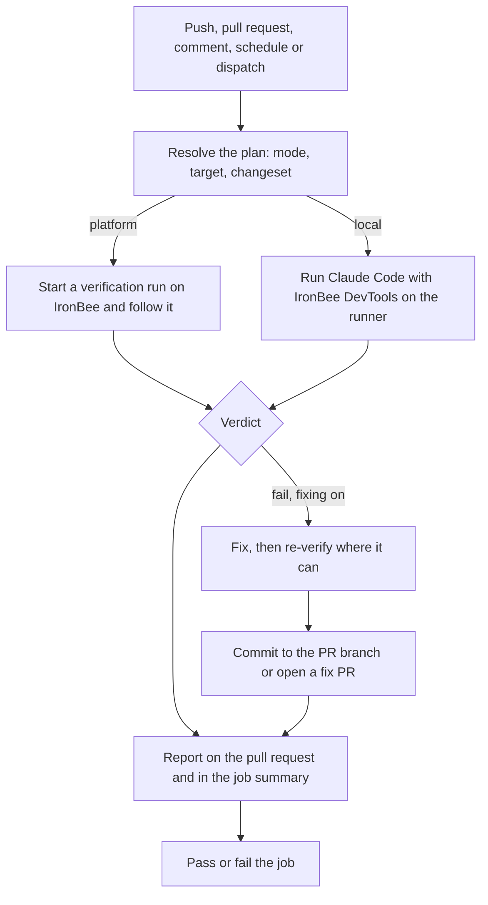

Every run of the IronBee Action follows the same path:
1. It resolves a plan and verifies the change.
2. When fixing is on, it fixes what failed and commits the fix.
3. It reports on the pull request and passes or fails the job.

Only the verification step differs between the two [modes](/github-action/concepts/verification-modes): on IronBee (platform mode) or on your GitHub runner (local mode).

---

## The run, step by step

```mermaid actions={false}
flowchart TD
    A[Push, pull request, comment, schedule or dispatch] --> B[Resolve the plan: mode, target, changeset]
    B -->|platform| C[Start a verification run on IronBee and follow it]
    B -->|local| D[Run Claude Code with IronBee DevTools on the runner]
    C --> E{Verdict}
    D --> E
    E -->|fail, fixing on| F[Fix, then re-verify where it can]
    F --> G[Commit to the PR branch or open a fix PR]
    E --> H[Report on the pull request and in the job summary]
    G --> H
    H --> I[Pass or fail the job]
```

<Steps>
  <Step title="Plan">
    The action decides the mode, the target and the changeset, and logs them together with the reason for the mode and the minimum `timeout-minutes` the run needs. It stops here, before installing anything, when the run can't work: no target, a fork pull request on a comment run, or an invalid input value.
  </Step>
  <Step title="Verify">
    **On IronBee:** the action installs the IronBee CLI and runs `ironbee verify run web`. That starts a verification run on IronBee and follows it until it ends.
    - For an app that runs on the runner, the action installs, builds and starts it first, and IronBee reaches it through a reverse tunnel.
    - The recording, screenshots and logs are kept in the IronBee Console.

    **On your runner:** the action installs Chromium, IronBee DevTools and Claude Code, writes `.ironbee/config.json` and runs `ironbee install --client claude`. Claude Code then verifies the change through IronBee DevTools. The evidence is uploaded as a workflow artifact and to IronBee.
  </Step>
  <Step title="Fix">
    This step runs when the verification fails, fixing is on (`verification_apply_fix`) and an Anthropic credential is set.
    - **On IronBee:** a Claude Code run on your runner edits the files to fix the reported issues. For an app that runs on the runner, the action then restarts it and runs a second verification. A deployed URL isn't re-verified, because the deployment still serves the code that was deployed.
    - **On your runner:** the agent fixes and re-verifies in the same session.
  </Step>
  <Step title="Commit">
    The action commits and pushes the fix itself; the agent only edits files.
    - On a pull request, the fix goes to the pull request branch.
    - Otherwise it goes to a new `ironbee/fix-<sha7>-<run_id>` branch with a pull request.
    - A fix whose re-verification fails is not pushed.
  </Step>
  <Step title="Report">
    The report is posted as a pull request comment, updated in place on later runs, and written to the workflow run's summary. It links to the run in the IronBee Console.
  </Step>
  <Step title="Pass or fail">
    The last step fails the job when the verification fails or ends without a verdict.
  </Step>
</Steps>

---

## What gets verified

The action binds each run to the change behind the event, so the verification looks at what changed rather than at the whole repository.

| Event | What gets verified |
|-------|--------------------|
| `pull_request` | The whole pull request |
| `issue_comment` | The pull request the comment is on. See [Verify from a pull request comment](/github-action/guides/comment-trigger) |
| `push` | Every commit in the push, from the event's `before` commit, or the commit against its parent when that base isn't usable |
| `workflow_dispatch`, `schedule` | On IronBee: the commit against its parent. On your runner: the whole application |

To verify the application without the repository, for example a private repository that the IronBee GitHub App doesn't cover, set `ironbee_bind_repository: false`.

---

## Where results appear

- **On the pull request:** the report comment, with a link to the run in the console.
- **In the workflow run:** the job summary and the job's pass or fail result. The `verdict`, `mode`, `job_id`, `job_url` and `artifacts_url` [outputs](/github-action/configuration/configuration#outputs) are available to later steps.
- **In the IronBee Console:** runs on IronBee appear on the project's **Verifications** tab with the trigger **GitHub Actions**. The project is the repository's GitHub project unless you set `ironbee_project`. See [Verifications](/console/verifications).

---

## What's next?

<CardGroup cols={2}>
  <Card title="Platform and local verification" icon="split" href="/github-action/concepts/verification-modes">
    Choose where the verification runs.
  </Card>
  <Card title="Running in CI" icon="git-branch" href="/github-action/guides/running-in-ci">
    Triggers, fix behavior and the report.
  </Card>
</CardGroup>
